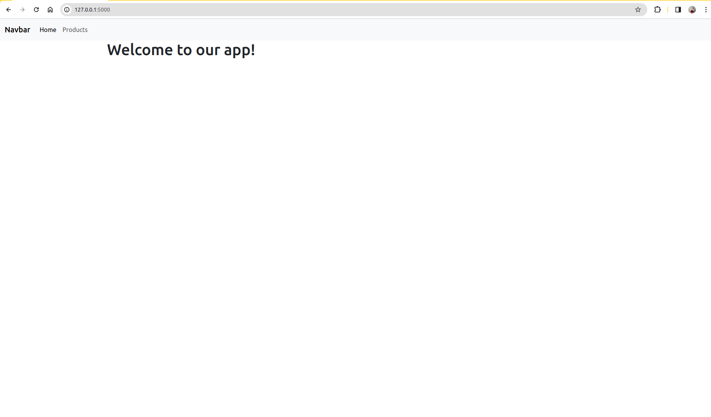
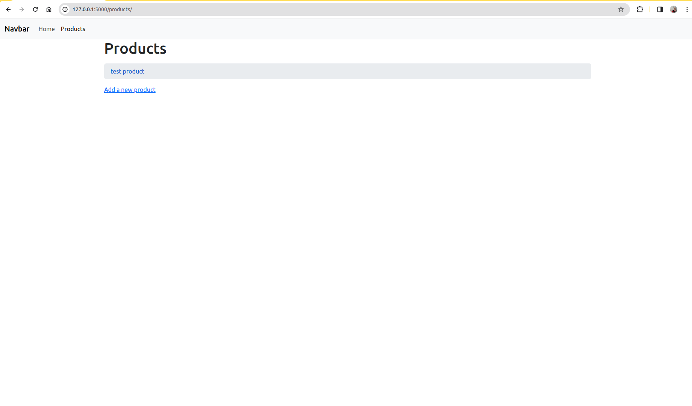
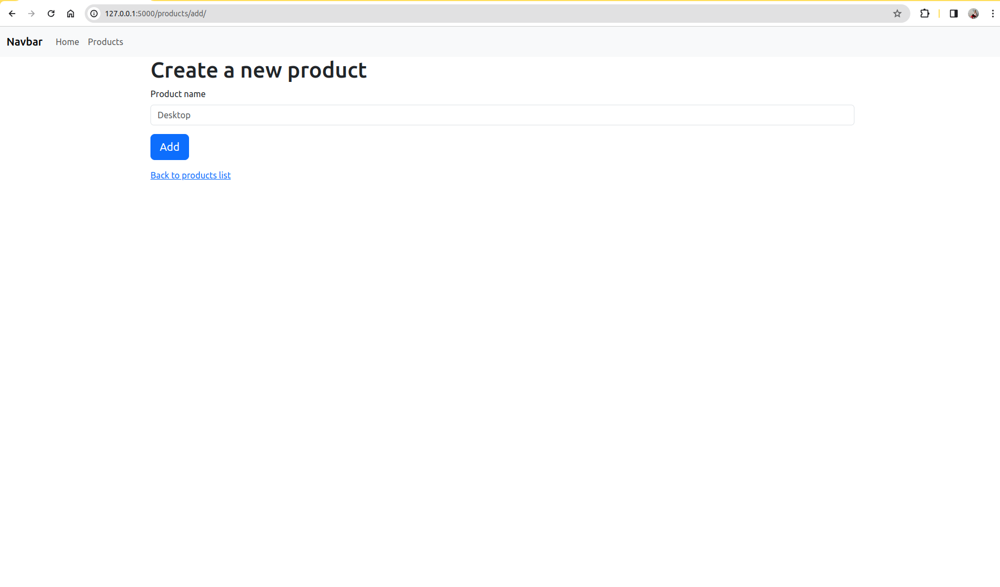
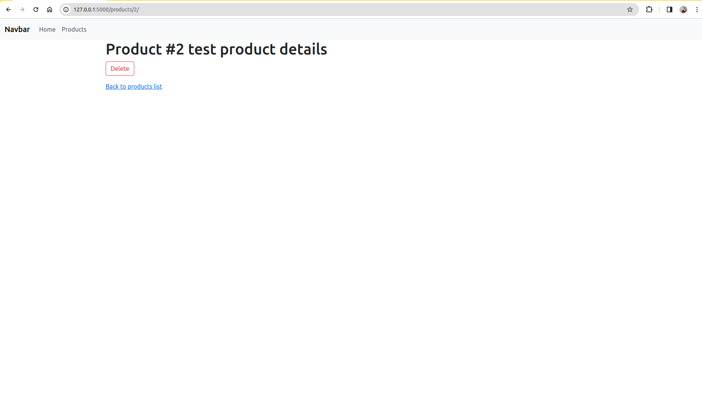
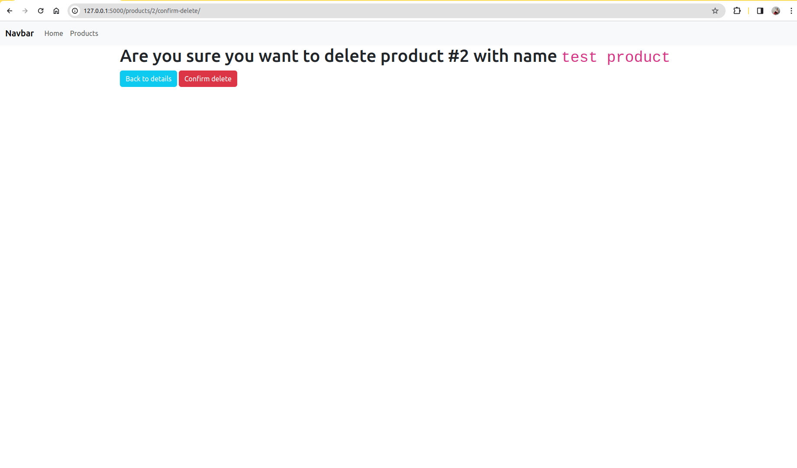
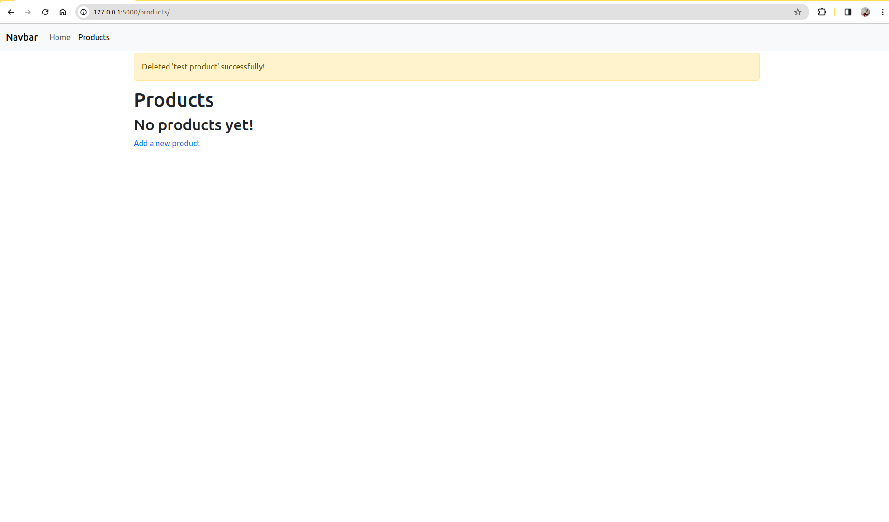

# Репозиторий "python-developer-basic"
### Данный репозиторий создан для выполнения домашних заданий по курсу "Python Developer. Basic | OTUS"
**Домашнее задание №1** - функции и структуры данных.
- Есть функция, которая принимает N целых чисел и возвращает список квадратов этих чисел.
- Есть функция, которая на вход принимает список из целых чисел, и возвращает только чётные/нечётные/простые числа (выбор производится передачей дополнительного аргумента).
- Есть отдельные функции для проверки на нечетные, четные и простые числа.
- Использована встроенная функция [filter](https://docs.python.org/3/library/functions.html#filter).

**Домашнее задание №2** - классы и модули.
- Есть базовый класс base.Vehicle с атрибутами и инициализатором, а также с методом, проверяющим, что топлива больше нуля,
и либо обновляет состояние started, либо выкидывает исключение. Есть метод, который проверяет,
что достаточно топлива для преодоления переданной дистанции,
и изменяет количество оставшегося топлива, иначе выкидывает исключение exceptions.NotEnoughFuel.
- В отдельном модуле создан класс с исключениями, который наследуется от Exception.
- В отдельном модуле создан датакласс Engine.
- В отдельном модуле создан класс Car с методом set_engine, который принимает в себя экземпляр объекта Engine и устанавливает на текущий экземпляр Car.
- В отдельном модуле создан класс Plane, с методом load_cargo, который принимает число, проверяет, что в сумме с текущим cargo не будет перегруза, и обновляет значение, в ином случае выкидывает исключение exceptions.CargoOverload.
Также есть метод remove_all_cargo, который обнуляет значение cargo и возвращает значение cargo, которое было до обнуления.

**Домашнее задание №3** - Docker контейнер c веб-приложением.
- Создан Dockerfile с установкой зависимостей и запуском веб-сервера.
- Как запустить контейнер: \
из директории python-developer-basic/homework_03 выполнить команду сборки: \
`docker build . -t web` \
а затем выполнить команду запуска: \
`docker run -it -p 8000:8000 web`

**Домашнее задание №4** - Асинхронная работа с сетью и БД.
- Созданы модели User и Post, асинхронный алхимичный (SQL Alchemy) engine, объект Session.
- Все запросы в сеть и БД выполняются асинхронно, скрипт стягивает данные с API и складывает в БД.
- Объекты пользователей и постов добавляются в БД пачками.
- Созданы связи между пользователем и постом.

**Домашнее задание №5** - Веб-приложение на Flask.
- Cоздано Flask приложение в `app.py`
- Добавлены вьюшки `/` и `/about/`
- Подключены и применены стили Bootstrap
- В базовый шаблон добавлена навигационная панель

**Домашнее задание №6** - Взаимодействие между контейнерами
- Создано приложение (на Flask + bootstrap), взаимодействующее с БД (SQLAlchemy)
- Приложение и БД запускаются с помощью docker-compose.
Как запустить контейнер: \
из директории python-developer-basic/homework_06_db_and_flask выполнить команду: \
`docker compose up --build app` \
Если возникнут проблемы с прогрузкой страницы Products, необходимо зайти внутрь запущенного контейнера: \
`docker compose exec -it app bash` \
и обновить бд: \
`flask db upgrade` \
Выйти из контейнера: \
`exit`
- Скриншоты страниц приложения:

**Домашнее задание №7** - Django проект
- Создано приложние "Доска почета" на Django с моделями и миграциями
- Приложение запускается из папки homework-07 командой: \
`python manage.py runserver`

**Домашнее задание №8** - Django Generics
